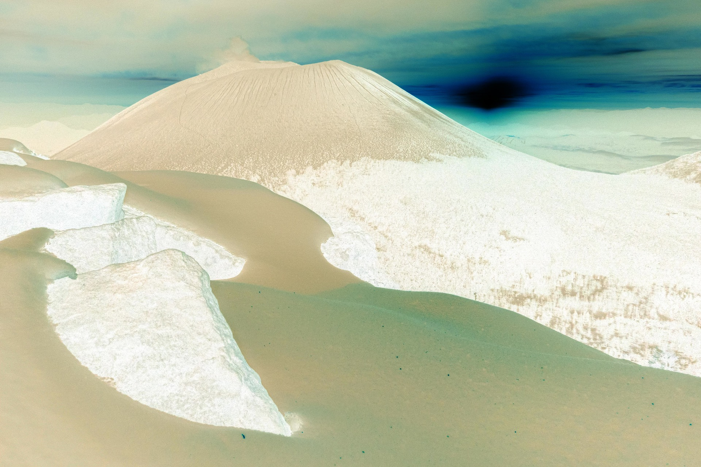
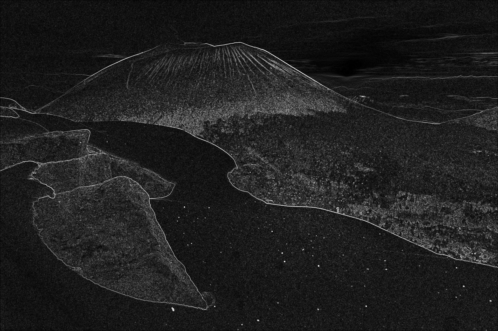

# Princeps Mathematicarum Imaginum: scientia et ars in imagine coniunctae.

The Mathematic Prince of Image : science and art gathered. A little project aiming at manipulating images.  
The project name is a reference to Carl Friedrich Gauss, considered as the Prince of Mathematics.

## Command-Line Interface usage

The tool works as a CLI. It takes several arguments as shown below. Notes that you must pass at least three arguments : the first being the path to the input image you want to treat, the second one, the path to the resulting image, and the last one the operation to perform.

`princeps_mathematicarum_imaginum.exe <INPUT_FILE_PATH> <OUTPUT_FILE_PATH> <COMMAND>`

- INPUT_FILE_PATH : The path of the file to process
- OUTPUT_FILE_PATH : The path where to store resulting image
- COMMAND : the operation to perform.

Example :  
`princeps_mathematicarum_imaginum.exe /path/to/my/image/mountain-8487679_1920.jpg /path/to/my/image/blurred_mountain.png filter gaussian_blur 0.8`

You can run command with `--help` flag to display help documentation.

### OPERATION argument
1) inverse (See [full documentation on inversion operation here](#inversion-operation))
2) gamma-correction (See [full documentation on gamma correction here](#gamma-correction)) : 
- GAMMA : the gamma value to use for correction, a floating value
3) filter (See [full documentation on available filters and their usage here](#filters)) :
- FILTER_TYPE : specifies the type of filter to apply
- FILTER_PARAMETER : (optional) an additional parameter, depending on filter type

## Available basic operations

### Inverse

Invert each pixel of the image, meaning that every white pixel became a black one, etc. Substantially, it substracts every channel value (ranged from 0 to 255, inclusive) of the pixel to 255.

Use `princeps_mathematicarum_imaginum.exe <INPUT_FILE_PATH> <OUTPUT_FILE_PATH> inverse` command to inverse an input image.

Example of an input image  

Resulting inverted image

### Gamma correction

Gamma represents the non‑linear relationship between the numerical values of an image (input) and the actual brightness produced on a display (output). It defines how midtones, shadows and highlights are distributed.

Most images are stored using a gamma‑encoded curve, so displays apply the inverse curve to reproduce the correct luminance. This is the goal of the gamma correction operation available in this tool.  

Use `princeps_mathematicarum_imaginum.exe <INPUT_FILE_PATH> <OUTPUT_FILE_PATH> gamma-correction <GAMMA>` command to correct image, depending on the given gamma value.  

Example of an input image  

Resulting image with gamma 0.8

Resulting image with gamma 2.2  

## Available filters

### Edges Detection using Sobel Filter

Compute intensity gradient of the input image to detect edges. This filter is a convolution, meaning that a matrix, known as kernel, applies a transformation to each pixel of the image by computing a new value based on the values of the pixel and its neighbours.

Use `princeps_mathematicarum_imaginum.exe <INPUT_FILE_PATH> <OUTPUT_FILE_PATH> filter sobel` command to apply it to input image.

Example of an input image  

Resulting edge detection using Sobel Filter

### Gaussian Blur

This algorithm blurs a given image using the Gaussian function. It takes a sigma value to define the size of the kernel used to blur every pixel of the given image. The Gaussian function is then used to fill the kernel with the neighbours weights.

Use `princeps_mathematicarum_imaginum.exe <INPUT_FILE_PATH> <OUTPUT_FILE_PATH> filter gaussian_blur [FILTER_PARAMETER]` command to apply it to input image, where FILTER_PARAMETER is the sigma value to use. If no sigma value is given, the kernel will be computed with a default value of 3.0.

Example of an input image  

Resulting blurred image with a sigma value of 3.0

Resulting blurred image with a sigma value of 10.5

#### Performance improvement

For better performance, the aglorithm uses separability property of the Gaussian function : G(x,y) = G(x) . G(y)  
It allows to apply the Gaussian function on one dimension (width of the image for example), then on the second one (height for example), to determine final result on the two dimensions.  
Indeed, the complexity when applying the 2D kernel directly on each pixel is O(k² . N), where k is the kernel size, and N the number of pixels of the image, but when applying the two separable 1D kernel, the complexity becomes O(k . N)

Furthermore, this separability allows us to parallelize image treatement, as now each row is independent (calculating row R only needs data from row R, and not the ones from previous or following rows) when doing the horizontal pass, and each column is independent when doing the vertical one.

## Goals :

1. Done : Basic pixels manipulation with `image` crate(read an image, and apply a simple transformation like color inversion)
2. Done : Implement a convolution filter (like Sobel one for edges detection)
3. WIP : Implement several filters (GaussianBlur, EdgeDetection, Sharpen) using POO
4. TODO : use `rayon` for parallel treatments and have quicker filters
5. DONE : create a reusable Rust crate with a simple CLI
6. DONE : add unit tests
